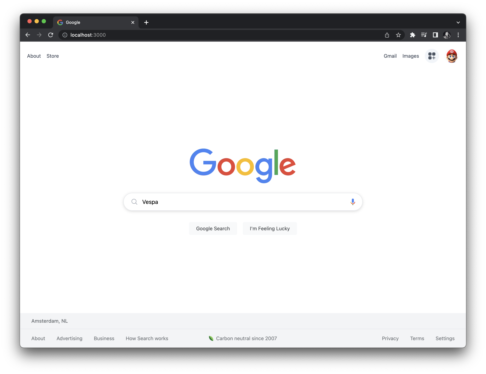

## Google Clone

> A frontend that makes use of Next.js and the Google (PSE) API.



Featuring:

- A [Next.js](https://nextjs.org/) project bootstrapped with [`create-next-app`](https://nextjs.org/docs/api-reference/create-next-app).

- The `index.js` page has a `form` that captures values from a `ref`. We use this to pass a router object, to a new page called `search.js`. We make use of [useRouter](https://nextjs.org/docs/api-reference/next/router).

```js
const searchHandler = (e) => {
  e.preventDefault(); // stop default behavior
  const term = searchInputRef.current.value;
  if (!term) return; // exit logic
  // otherwise, forward to `pages/search.js` with the query param `term`:
  router.push(`/search?term=${term}`);
};
```

If you want to access the router object inside any function component in your app, you can use the `useRouter` hook. The following is the definition of the `router` object returned by both useRouter and withRouter.

```js
function Search({ query, route, results }) {
  const router = useRouter();
  return (
    <div>
      <Head>
        <title>Search Results: {router.query.term}</title>
      </Head>
      <SearchHeader />
      <SearchResults results={results} />
    </div>
  );
}
```

- The props needed for `search.js` are (pre-rendered) via `getServerSideProps`.
- The Programmable Search Engine API to search based on the `context.query`.

```js
/* # Programmable Search Engine:
It enables you to create a search engine for your website, your blog, or a collection of websites. You can configure your search engine to search both web pages and images. You can fine-tune the ranking, customize the look and feel of the search results, and invite your friends or trusted users to help you build your Programmable Search Engine. For more info, see https://programmablesearchengine.google.com/cse/all */

/* # A Custom Search JSON API (Get an API Key) > `NEXT_PUBLIC_API_KEY` Lets you develop websites and applications to retrieve, display search results from Programmable Search Engine (PSE) programmatically. With this API, you can use RESTful requests to get either web search or image search results in JSON. For more info, https://developers.google.com/custom-search/v1/overview. */

/* # Adding a new Custom Search Engine (CSE) > `NEXT_PUBLIC_CONTEXT_KEY`. Get started by providing some basic information about your engine. You'll be able to customize the engine's configs (languages, regions, etc.) further after it is created. For more info, see https://cse.google.com/cse/create/new. */
export async function getServerSideProps(context) {
  // Copy searched object as free tier only gives 100 queries a day limit.
  // This ensures we not exhausting any query quota.
  const useLocalCopy = true; // toggle to before query.
  // console.log(context.query);
  // Pagination also known as paging, a process of dividing into discrete pages.
  const startIndex = context.query.start || "0"; // here!

  const baseUrl = "https://customsearch.googleapis.com/customsearch/v1";
  const data = useLocalCopy
    ? responseCopy
    : await fetch(
        `${baseUrl}?cx=${process.env.NEXT_PUBLIC_CONTEXT_KEY}&q=${context.query.term}&key=${process.env.NEXT_PUBLIC_API_KEY}&start=${startIndex}`
      )
        .then((res) => res.json())
        .catch((err) => console.log(err));
  return {
    props: {
      results: data,
    },
  };
}
```

Regards, <br />
Luigi Lupini <br />
<br />
I ❤️ all things (🇮🇹 / 🛵 / ☕️ / 👨‍👩‍👧)<br />

## Getting Started

First, run the development server:

```bash
npm run dev
# or
yarn dev
```

Open [http://localhost:3000](http://localhost:3000) with your browser to see the result.

You can start editing the page by modifying `pages/index.js`. The page auto-updates as you edit the file.
